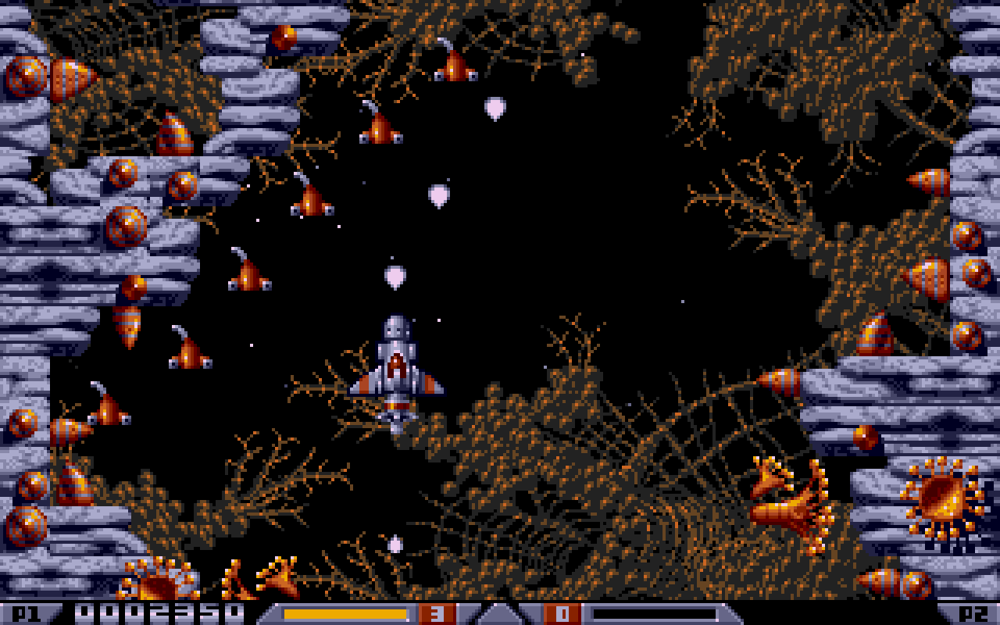
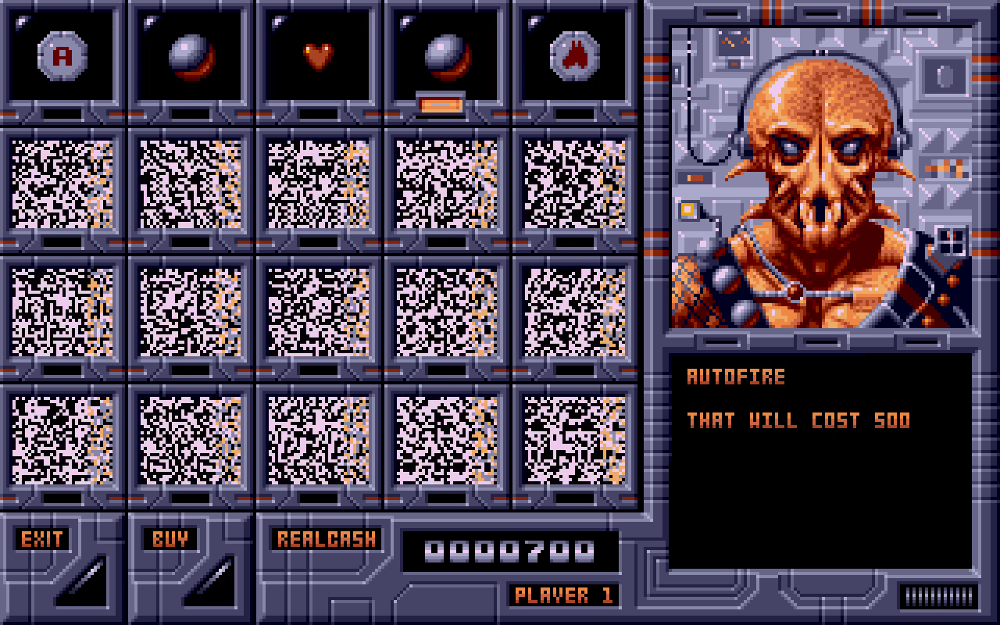
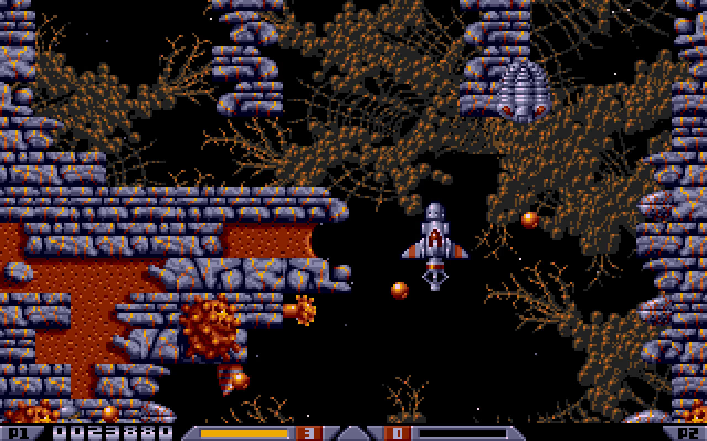

# Xenon 2 Go

An independent Go/Ebitengine recreation of Xenon 2: Megablast for the Amiga.
The original disk is used only by local extraction and comparison tools.
The game engine uses ordinary Go state and exported audiovisual data;
it does not execute the original program or load its code as game logic.

The conversion is in development. The current reference build displays the
original menu and five level maps, moves the ship and enemy formations, and
replays the original soundtrack. It includes source-derived weapons,
carrier rewards, checkpoint recovery, alternating players, and both sections
of the five levels, including their compound guardians. Original shop, attract,
HUD, loading and ending presentation are connected. All fixed encounter families
are implemented. A current ordinary-input reference journey completes the five
stages, collects the complete final reward, shows the ending and starts a second
round. Integrated Amiga audiovisual and timing comparisons remain in progress.

**Original resources are prepared from your own Amiga game disks.** The original
ADF, recovered programs and exported game assets are not included in the
repository. [Prepare the resources](docs/ASSET_SETUP.md) with the supplied Go
import/export tools before playing.

## Presentation and screenshots

[](https://www.malakhsoftware.com/games.html#xenon2)

[Watch the five-minute presentation with sound and English captions](https://www.malakhsoftware.com/games.html#xenon2)
on Malakh Software. It includes the original intro, menu, first-stage expert
play and the first merchant visit. The caption band sits below the complete
game image. [English subtitle transcript](docs/media/xenon2-presentation.en.srt).

| Original merchant | Later first-stage scenery |
| --- | --- |
| [](docs/images/merchant.png) | [](docs/images/later-stage.png) |

Create the MP4 and WebM presentation locally after preparing the game assets:

```sh
./scripts/record-presentation.sh
```

The capture, caption panels, editable English SRT and movies remain under the
locally excluded `recordings/` directory. The preparation tool and caption text
are included under `tools/presentation/`; no extra font installation is needed.

## Three-level demonstration

```sh
GOWORK=off go run ./cmd/xenon2 -demo
```

DEMO MODE, the desktop flag and Android's automatic demonstration play levels
one through three. After the third guardian, the original exit rewards and
final merchant, the tour returns through the original menu animation. Sixty
seconds without input on that menu starts a new level-one tour. The automatic
startup deadline also applies throughout the passive logo, credits and scores
presentation; the normal loading and READY transitions follow it.

The pilot supplies ordinary movement, fire and dive commands and buys upgrades
through the original merchant quote/confirmation interface. It uses actual
health, equipment, earned money, collisions, enemies and random state. A key,
mouse action or touch immediately returns the same active session to manual
control. Pause, fades, the cheat menu, interactive game messages and merchants
do not count as menu inactivity.

Both demonstration paths use the original merchants, guardian damage and exit
rewards, then return to the original menu. Camera-aware projectile forecasts
restore both complete three-level journeys with all three ships and both continue
credits intact, including the source-correct burst bullets and guardian state.
The independent scorecard also records no ship losses or spent continues.
[Targeting and collection results](docs/EXPERT_TARGETING.md) identify the current
measurements and limits. No result establishes collection of every enemy or
bonus under every starting state.

The pilot rehearses known formations and their actual callbacks, prepares its
next decision while verified controls execute, and rejects a prepared plan if
the live state differs. Rear and side guns retain useful firing windows alongside
the forward weapon. Damageable plants and cannons drawn into the terrain remain
aim targets. Reachable bubbles receive reserved planning candidates, while
cannon attack positions yield to the terrain route when a rearward turn is
needed. Corridor forecasts keep the complete prepared turn, and the
final worm has a separate survival and aiming forecast.

[Original reward and explosion comparisons](docs/REWARD_CONSTRUCTORS.md) cover
creation under shared-pool pressure, inherited bubble motion and effect voices.
The controller reconsiders a retained escape if it predicts another shield loss
and values actual partial damage while clearing a stationary emitter.

Existing later-stage code and reference fixtures remain in the project. They
are outside the three-level demonstration tour. The separate
[five-stage reference validation](docs/FIFTH_FINISH_VALIDATION.md) starts at the
ordinary intro and retains earned equipment throughout. It loses one ship in
the last fight, spends no continue and enters round two with two ships. It uses
recorded controls after final admission; it does not extend the public expert
tour beyond stage three. Full-game audiovisual equivalence remains under review.

## MP4 recording

```sh
GOWORK=off go run ./cmd/video -duration 3m -output recordings/xenon2-presentation.mp4
GOWORK=off go run ./cmd/video -complete-level1 -output recordings/xenon2-level1-presentation.mp4
```

The recorder captures the original game canvas at 1280 × 800 and 60 FPS, with
the game's own stereo soundtrack and effects. It uses DCK v1.0.14's offline
video/audio route and FFmpeg for H.264/AAC encoding; other windows and system
audio are never captured. The default three-minute presentation follows the
intro, menu and first-level play. Its presentation controller approaches actual
enemies and reachable bonuses, commits to short tactical routes and holds aimed
firing bursts in the opening and retains useful target windows in later combat. Known terrain junctions guide the route
before a wrong branch closes. A trapped ship can reverse to the junction and
rejoin its forward route. Targeting forecasts the source paths and the next gun
position; reward collection follows the moving coin rather than its old anchor.
Upcoming formations can also guide preparatory movement, without firing early.

The complete-first-level option includes the intro, both merchants, final guardian
and exit drops, then stops before playing level two. The latest recording is
381.53 seconds (6 minutes 21 seconds), with all three starting ships remaining.
Its MP4 contains 22,892 frames at 1280 × 800 and 60 FPS, with stereo AAC audio
and embedded scene chapters. The current desktop graphics tests also pass.
This capture was generated from runtime `0a9efa0`.
Ordinary damage and purchases still apply. The first-three-stage validation uses
the real intro, merchants, native guardian damage and exit drops. Both current
starts pass their unchanged survival checks with three ships and two continues.
Later-stage expert strategies remain experimental; the normal tour ends after level three. See
[expert forecast design](docs/EXPERT_FORECAST.md) for the verified boundaries.
Generated MP4, PNG poster and chapter JSON files stay
under locally excluded `recordings/`. The export command requires Go 1.26 or
newer and FFmpeg. A different positive `-duration` records a longer excerpt.

## Android

```sh
./scripts/run-android.sh
```

The landscape version keeps the original game canvas and adds a virtual joystick,
FIRE/DIVE buttons and ENTER/MENU/PAUSE/CHEATS controls in the side margins.
The joystick stays captured while dragging, supports diagonals and works with
simultaneous fire and dive touches. Menus and merchant cells also accept direct
taps. The activity keeps the screen awake while the game is visible.

The script builds an ARM64 test APK, installs it on the authorized USB device
and starts the app. See [Android build and controls](docs/ANDROID.md) for SDK,
device and validation details. Generated APK/AAR/Gradle outputs remain excluded.

## Optional trainer settings

Select CHEATS on the menu, use `-cheats` at launch, or press F3 during a game. The submenu provides
infinite ships, continues, money and energy, optional equipment keys, and a
starting level from one to five. All aids are disabled by default; active aids
are marked on the playfield. F3 or Escape returns to the caller.

The settings reproduce the supplied Amiga trainer's boundaries: infinite energy
suppresses shield damage but does not prevent terrain crushing. Infinite money
grants 5,000,000 at merchant entry with a 30,000 stock limit; purchases still cost
the original prices and retain equipment compatibility. Infinite ships retain
death/checkpoint recovery and alternating player turns.

Equipment keys work only when KEY FUNCTIONS is ON. The KEY HELP page lists the
adapted desktop controls. The shortcut layout reserves F3 for settings and uses F1/F2/F4–F10 for common
upgrades, numeric keypad 0–9 for weapons/dive, B/H/O/V for bomb, homing missile,
protection and Shades, and Delete/Insert for energy.
These aids are optional player choices; ordinary demo validation keeps them off.

## Local resources

Supply a compatible original Amiga ADF in a local directory. Original disks,
compressed containers, recovered programs and generated assets are not included
in Git. Extraction tools rebuild the local resources reproducibly.

The [Planet Emu Amiga ADF catalogue](https://www.planetemu.net/roms/commodore-amiga-games-adf?page=X)
helps identify **Xenon 2 - Megablast**. The currently verified single-disk
revision is labeled `[cr BS1][h Black Monks][t +36 Black Monks]`; the asset guide
lists its checksum and the complete preparation commands.

```sh
./scripts/prepare-assets.sh -adf "/path/to/Xenon 2.adf"
GOWORK=off go run ./cmd/xenon2
```

Use the arrow keys or WASD for movement and Space or Control for firing; Alt
requests a dive. In reference views only, keys 1–5 select a level
and F2 opens the shop inspection route. Escape restarts the attract sequence;
from the menu it closes the desktop window. M toggles
music. P pauses gameplay; any key or a fire click resumes it while the soundtrack
continues. The normal menu supports one or two alternating players. Full source
timing and framebuffer comparisons remain in
progress for integrated scenes and the complete five-level run.

```sh
GOWORK=off go run ./cmd/xenon2 -view level -level 1
GOWORK=off go run ./cmd/xenon2 -view attract
GOWORK=off go run ./cmd/xenon2 -view menu -frames 120 -screenshot .local/menu.png
GOWORK=off go test ./...
```

`./scripts/check-desktop.sh` runs the renderer tests and bounded menu, attract,
shop and five-level captures. It needs an active desktop session and rebuilt
local assets. Captures are saved under `.local/captures/desktop-check/`.

Rendering runs at 60 display updates per second. Ship motion, paths, firing and
scrolling use a separate simulation clock; interpolation does not speed up the
game. Audio follows its own original 50 Hz replay clock.

The first native A500 gameplay capture scrolls about 16.7 source pixels per
second, corresponding to three PAL refreshes per pass. This measured early-game
profile is now the default. Use `-logic-pal-refreshes 2` to select the source's
two-refresh maximum (25 passes/s) for comparison. Dense-scene and later-level
cadence still need integrated native measurements.

The intro's expensive credit zoom uses the recorded A500 average: 15.5 passes/s,
giving six seconds per 93-pass credit pair. This is a stable average adaptation
of the observed workload-dependent cadence. Menu, shop, audio and palette fades
retain their separate clocks; changing gameplay timing does not accelerate them.

See [implementation coverage](docs/IMPLEMENTATION_COVERAGE.md),
[reference notes](docs/REFERENCE_NOTES.md) and the
[native-data audit](docs/NATIVE_AUDIT.md) for verified findings and comparison
boundaries. The supplied disk is a trained revision; trainer behavior is kept
separate from the original game's rules.

The [asset setup guide](docs/ASSET_SETUP.md) describes the reproducible extraction
pipeline, and the [audio notes](docs/AUDIO.md) document the independent replay.

To build a standalone desktop executable after extraction:

```sh
mkdir -p bin
GOWORK=off go build -o bin/xenon2 ./cmd/xenon2
./bin/xenon2
```

The exported assets are embedded at build time. A clean checkout can compile
the tools and game before extraction, but playing requires the local resources.

Generated references and captures remain local. The original shop's static
bitmaps and portrait poses, all sixteen caption/logo sampling steps, the HUD and
starfield state have source comparisons. The first final guardian controller
matches 1,200 original passes, and its articulated chain matches 9,280 segment
states. These checks do not establish the complete five-level game.
